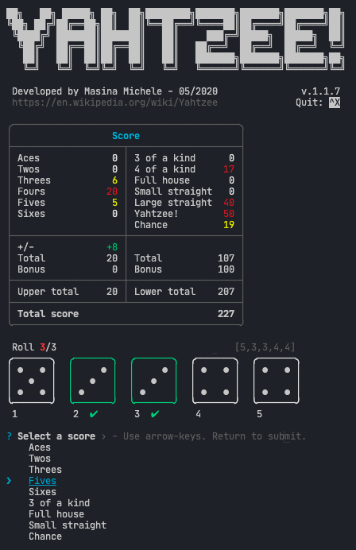

# Yahtzee!

Play [Yahtzee!](https://en.wikipedia.org/wiki/Yahtzee) in your _terminal_ in 3 easy steps:

- Clone the repo
- Run `npm install`
- Run `npm start`

## Known issues

- Missing end of game condition.
- The only way to quit is to enter '6' in the dice prompt and the game will quit at the next round.
